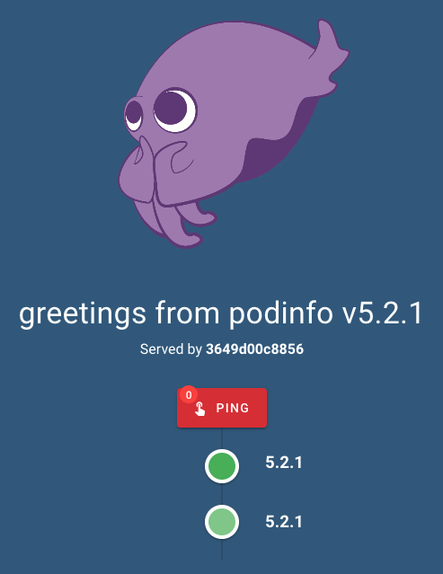

# Running Code

In this section, we will:

- Learn about the abstractions Kubernetes uses to run lots of pods at once
- Start a little demo application called [podinfo](https://github.com/stefanprodan/podinfo)
- Start a shell inside the deployed app and play around with it
- Scale the app up and down
- Deploy a new version of the app

Kubernetes runs code in the form of **containers** using **images** as the starting point. So thoroughout this section, we'll be talking about containers and images a lot:

- [A **container**](https://www.docker.com/resources/what-container) is a form of packaging code so that you can run it in the same way on lots of different systems. A container is mostly the same thing as a **Docker container** – you can consider them to be the same for now.
- An **image** is a snapshot of a container, ready to run, but without any state. Think of an image as a container that's never been started. We use this image as a "template," make a copy of it, and call the copy a container.

While this section focuses on running ready-built Docker containers inside a Kubernetes cluster, you may find value in learning the following so you can build and deploy your own app:

- Pull an image from [Docker Hub](https://hub.docker.com/)
- Run a Docker image locally
- Package a project into a tagged Docker image using `docker build` with a `Dockerfile`
- Push a tagged Docker image to a registry

If you're interested in learning more Docker skills, check out these resources:

- [Official Docker 101 Tutorial](https://www.docker.com/101-tutorial): An interactive tutorial that you can run in Docker locally or in a ready-to-go cloud environment
- [Docker Curriculum](https://docker-curriculum.com/): A straightforward tutorial that covers building your first Docker app and putting it online via AWS Elastic Container Service

OK, let's go!

## Introducing the podinfo app

[Podinfo](https://github.com/stefanprodan/podinfo) is a Hello World-style application. It displays a cute logo, shows some stats about the system on which it's running, and lets you ping it to show that it's answering web requests in realtime.

We will deploy this podinfo app to your cluster. If you want to try it locally, you can run:

```sh
docker run -it -p 9898:9898 stefanprodan/podinfo
```

Then visit http://localhost:9898 to see the cuttlefish:



## Pods

When Kubernetes needs to run a container, it packages one or more containers into a **Pod**. The [Kubernetes docs](https://kubernetes.io/docs/concepts/workloads/pods/) suggest that you can think of a Pod "as in a pod of whales or a pea pod."

In this section, we will only run one container in each Pod. In the field, you might see multiple containers in the same Pod.

<details>
<summary>Why would I want to run multiple containers in one Pod?</summary>
<p>When containers share a Pod, they:</p>
<ul>
<li><strong>share</strong> network resources</li>
<li>can <strong>share</strong> filesystem mounts, allowing them to use the same directories cooperatively</li>
<li><strong>do not</strong> share CPU quotas</li>
<li><strong>do not</strong> share memory quotas</li>
</ul>
<p>In a Pod with multiple containers, an auxiliary container often provides one of the following features to an app container:</p>
<ul>
<li>authenticated database access</li>
<li>some kind of frontend, such as an nginx webserver or proxy</li>
<li>log forwarding</li>
<li>metric capturing</li>
</ul>
</details>

A Pod's job is to make sure that its containers start up and stay up. If a container crashes, the Pod is responsible for restarting it. But a Pod only knows about each of its container instances, and a Pod can't be split among nodes of your cluster.

If you only run one Pod for your app, and the pod is running on a node, and that node crashes, your app goes offline.

## ReplicaSets

A **ReplicaSet** acts as a supervisor to ensure Pods are online and working properly. Its responsibility is to ensure the Pod you specified is running and your Pod has the right number of **replicas** online.

If you start a Pod on its own, Kubernetes might destroy your Pod in the case of a node crash or a disruptive node upgrade. So we don't run Pods on their own for real apps. We use ReplicaSets, which are durable, to manage Pods, which are sort of transient.

Generally, we don't manage ReplicaSets directly. We use Deployments to manage ReplicaSets which manage our Pods. We tell you about ReplicaSets here because you'll see them used when you start working with Deployments.

## Deployments

A **Deployment** manages ReplicaSets in a declarative way:

- When you need **more or less Pods**, you change the replica count in the Deployment spec. The Deployment updates the underlying ReplicaSet's replica count for you.
- When you need a **different image** running in your Pod, you change the Pod spec in the Deployment spec. The Deployment performs a **rollout** to create a new ReplicaSet and pods, and destroy the old ReplicaSet and pods, without interrupting your application's uptime.
- When you want to change **lots of things** at once, you simply change the Deployment spec. The Deployment takes care of the changes that need to be made without you having to worry about the details.
